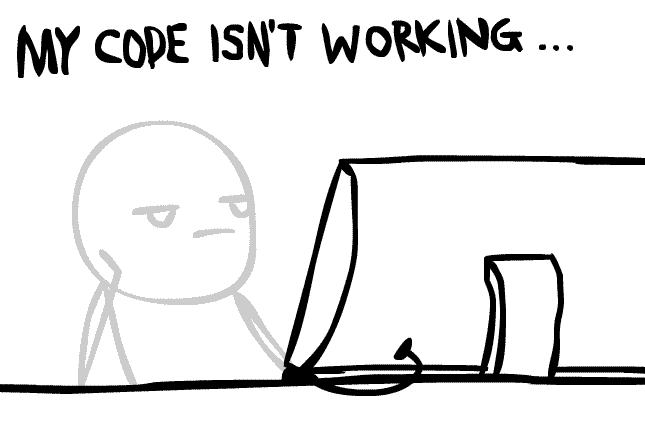

  

###

  

###

<h1 align="center">Hey there/Živjo 👋</h1>

###

<h3 align="left">👩‍💻  About Me</h3>

###

I'm Žiga from Slovenia  - 🔭 I’m working as Software Developer - 📚 I'm currently learning User Experience approaches, Product Management and Rust - 🧠I'm interested in Human Cognition with a focus on Creativity and Innovation

###

<h3 align="left">🛠 Languages</h3>

###

  
  
  
  
  
  
  

###

<h3 align="left">📊   My Github Stats</h3>

###

  

